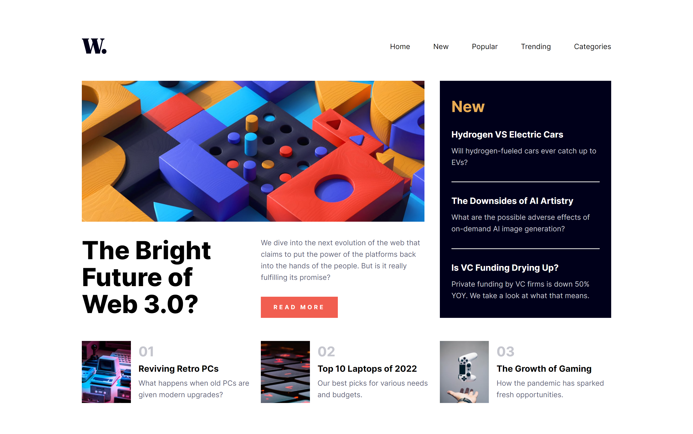

# Frontend Mentor - News homepage solution

This is a solution to the [News homepage challenge on Frontend Mentor](https://www.frontendmentor.io/challenges/news-homepage-H6SWTa1MFl). Frontend Mentor challenges help you improve your coding skills by building realistic projects. 

## Table of contents

- [Overview](#overview)
  - [The challenge](#the-challenge)
  - [Screenshot](#screenshot)
  - [Links](#links)
- [My process](#my-process)
  - [Built with](#built-with)
  - [What I learned](#what-i-learned)
  - [Continued development](#continued-development)
- [Author](#author)

## Overview

### The challenge

Users should be able to:

- View the optimal layout for the interface depending on their device's screen size
- See hover and focus states for all interactive elements on the page

### Screenshot



### Links

- Live Site URL: [https://tolasc.github.io/news-homepage/](https://tolasc.github.io/news-homepage/)

## My process

### Built with

- Semantic HTML5 markup
- Flexbox
- CSS Grid
- CSS custom properties
- CSS Transitions
- Mobile-first workflow

### What I learned

For the CSS layout, I delved more into how to utilize CSS Grids to layout the content how I wanted it to be. I was already familiar with creating templates and rows but one thing I learned during this was how to make content take up more than one column/row. This allowed to set CSS Grids while also allowing content more space within the grid.

This was the first time I used CSS transitions in my code. After trying it out, they are actually fairly simple to use for simple transitions! 
```css
div.sidebar {
  ...
  transform: translateX(100%);
  transition: transform .3s ease-in-out;
}
div.sidebar.visible {
  transform: translateX(0);
}
```

### Continued development

I want to try and implement more transitions and animations through CSS to liven up websites. Since this was the first time I used CSS transitions, more experience with animations and transitions would allow me to create more complex animations.
## Author

- Frontend Mentor - [@yourusername](https://www.frontendmentor.io/profile/Tascate)
